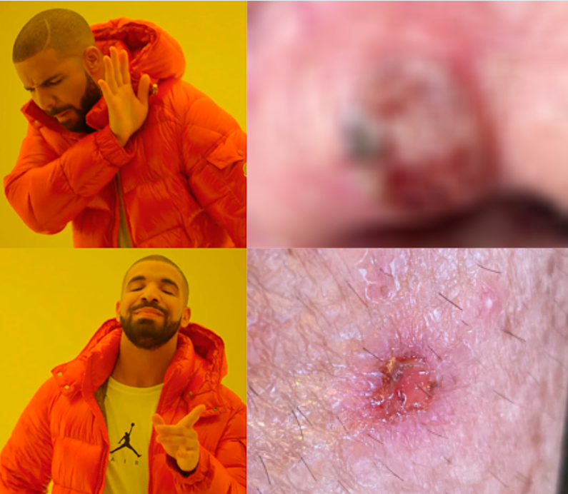

# Anotação de Qualidade de Imagens de Lesões de Pele 📝

Olá, sejam bem-vindos ao repositório! Essa é a ferramenta oficial de anotação da qualidade de imagens do LIFE. A seguir, vocês verão todas as instruções necessárias para utilizar o repositório.

<div align="center">
  
</div>

## 📒 Dataset
Primeiramente é importante que você tenha um dataset organizado em um diretório da seguinte forma:
```
dataset/
├── 1.png
├── 2.png
├── 3.png
├── 4.png
└── ...
```

## ⚙️ Configurações
Para utilizar o repositório é necessário criar um arquivo `.env`:
```env
IMAGES_PATH=path/to/images/dataset
JSON_PATH=path/to/json
```
Se você ainda não gerou o json, coloque o caminho completo de onde você deseja salvar este arquivo, incluindo o nome do arquivo .json. Em seguida, siga as instruções da seção pré-processamento.

## 📈 Pré-processamento
Além das imagens, é necessário ter um arquivo json específico que controla a anotação das imagens em questão. Portanto, antes de qualquer coisa é necessário gerar este arquivo. <br>
Para isso, basta executar o seguinte comando no terminal:
```bash
python preprocess/make_data_json.py
```
## 💻 Como executar?
Com o json gerado e os caminhos definidos, basta executar:
```bash
docker-compose up -d
```
E pronto! A ferramenta estará disponível em `http://localhost:3000`.
